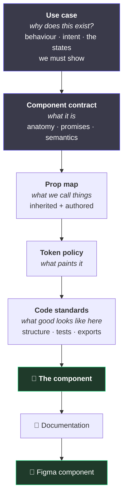
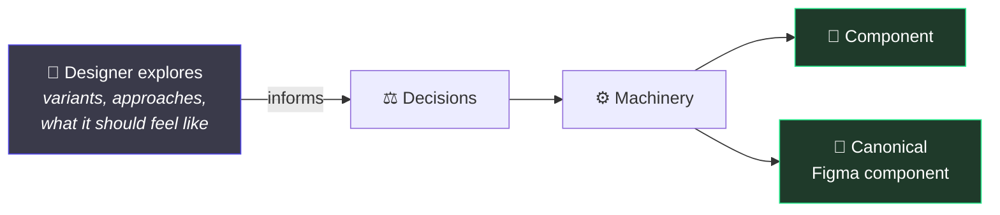

# 1. How this is meant to work

← [Index](./README.md) · Next: [The two halves →](./02-the-two-halves.md)

---

## The one sentence

> **You don't fix the output. You fix the system that produced it.**

Every solved problem compounds instead of evaporating. That is the whole idea; everything below is
machinery for making it true.

## What that means in practice

A button has the wrong padding. Two ways to respond:

|        | What you do                                                           | What you get                                           |
| ------ | --------------------------------------------------------------------- | ------------------------------------------------------ |
| Normal | Edit the button                                                       | A fixed button. The next one has the same bug.         |
| Here   | Fix whatever let the wrong padding through — a token, a rule, a check | Every button, forever, including ones nobody has built |

The second is slower once and free every time after.

## The pipeline

A component is not written. It is **produced**, from a stack of contracts that each answer one
question:

The first two are **framework-agnostic**. A use case and a component contract describe a thing that
has behaviour and states — not a React thing. Same contract, built in React today and something
else later, without re-deciding what the component _is_.

Only from the prop map down does the framework matter.

## Figma is an output, not the source

The surprising part: **the canonical component is machine-generated, and so is its Figma version.**

This does **not** mean designers stop working in Figma. Explore freely — that is what Figma is
for, and a decision made without exploring is a guess.

It means the _published_ component in the library is generated from the same contracts the code
comes from. Two artifacts, one source. They cannot drift, because neither is copied from the
other.

Hand-maintaining both is the drift everyone has lived through: the code gains a size, the Figma
library does not, and six months later nobody knows which one is lying.

## Where today's repo actually is

Being straight about this, because a diagram of an intended system reads exactly like a diagram of
a real one:

| Piece              | Today                                                                         |
| ------------------ | ----------------------------------------------------------------------------- |
| Component contract | **Built.** Schema, gate, composer. Currently React-shaped, not yet agnostic.  |
| Prop map           | **Built** as authored canon vs measured reality. No inheritance layering yet. |
| Token policy       | **Built**, and checkable.                                                     |
| Code standards     | **Written as prose**, not yet a contract a machine can check.                 |
| Use case contract  | **Not built.**                                                                |
| Docs generation    | **Not built.**                                                                |
| Figma generation   | **Not built.** The Figma link is read-only today.                             |

So: the middle of the pipeline exists and works. The ends do not yet.

## Why bother with contracts at all

Because the alternative is that all these decisions still get made — just invisibly, by whoever
happens to be typing, and never written down.

Ask a normal design system "why is this a button and not a link", "which token is this background
_supposed_ to be", "is this finished" — and the answer lives in one person's memory. Contracts are
just those answers, written where a machine can check them.

---

Next: [The two halves of a component →](./02-the-two-halves.md)
