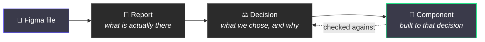

# 1. What this whole thing is

← [Index](./README.md) · Next: [The two halves →](./02-the-two-halves.md)

---

## The short version

This repo is a design system with **no components in it**.

That is not an oversight. It ships everything _around_ the components — the token pipeline, the
rules, the checks, the record of decisions — and leaves the components for you to build.

## Why on earth would you ship it empty

Because a component is the _last_ step, not the first.

Most design systems get built the other way round. Someone draws a button, someone else codes it,
and six months later the team is arguing about why there are three greys called "surface" and
whether `emphasis="high"` and `hierarchy="primary"` are the same thing. All those questions
existed on day one. Nobody wrote them down, so they got answered by accident, one commit at a
time.

This template makes you answer them first:

1. **Explore** — read the design file and write down what is measurably there. Not opinions. How
   many colours, what the spacing steps actually are, where two things contradict each other.
2. **Report** — that write-up ends in open questions, never in answers.
3. **Decide** — each question becomes a short record: what we chose, what it costs, what it rules
   out. These are called ADRs, and they are just markdown files.
4. **Build** — the component is built against a decision that already exists. And the tooling
   checks that it was.

The dotted line matters most. The component is not just _inspired by_ the decision — it is
**checked against** it, mechanically, every time anyone pushes.

## An analogy

Think of a Figma library file that has been set up properly before anyone draws anything.

The variable collections exist and are named consistently. The page structure is agreed. There is
a doc page saying what "surface" means and when to use it instead of "background". The naming
convention is written down where people will actually see it.

**The canvas is still empty.** But the first component someone draws in that file will be better
than the first component drawn in a blank file, and the hundredth will be _far_ better.

That is what this repo is, for code.

## What is actually in the box

|                   | What it is                   | Designer translation                                                        |
| ----------------- | ---------------------------- | --------------------------------------------------------------------------- |
| `packages/tokens` | Token pipeline               | Your Figma variables, turned into something code can use                    |
| `packages/react`  | The component library        | Empty. You fill it.                                                         |
| `apps/sandbox`    | A preview page               | A blank artboard to drop a component onto                                   |
| `apps/storybook`  | A component browser          | Off by default; switch it on when there is enough to browse                 |
| `docs/ADR`        | Decision records             | The "why we did it this way" file that usually only lives in someone's head |
| `docs/research`   | Findings                     | What we measured, before anyone decided anything                            |
| `.ai/maps`        | The vocabulary               | A shared dictionary of prop names, so nobody invents a synonym              |
| `.figma`          | The link to your design file | Which file, and how its names map to code names                             |
| `.claude/skills`  | Agent instructions           | How an AI agent is told to do each of the four steps                        |

## The part you will actually care about

Most of this you can ignore. The bit worth understanding is the **contract** — a small file next
to every component that records the things the code cannot say for itself.

That is what the rest of these pages are about.

---

Next: [The two halves of a component →](./02-the-two-halves.md)
