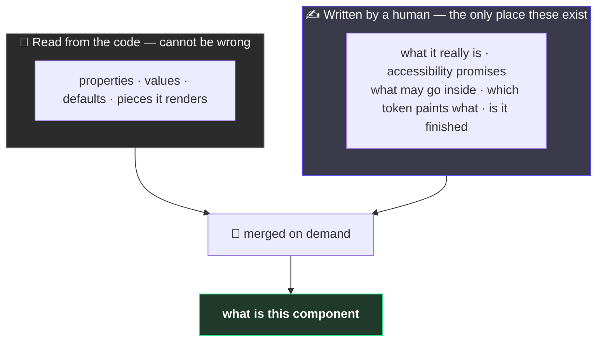
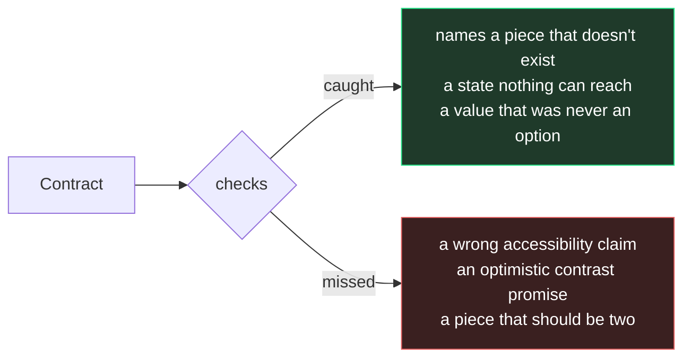

# 2. The two halves of a component

← [Previous](./01-what-this-is.md) · [Index](./README.md) · Next: [Naming the pieces →](./03-anatomy-and-parts.md)

---

## The problem

Open a component in Figma. The properties panel tells you a lot: three sizes, three emphasis
levels, Medium is the default.

Now ask it something else:

- Is this a button or a link?
- If someone puts only an icon in it, who gives it a name a screen reader can read?
- That background — is it _supposed_ to be a surface token, or did someone paste a hex at 6pm?
- Is this finished, or still being figured out?

**There is no field for any of that.** The information exists, in one person's head. They leave,
and the only way to find out is to read the code and guess.

## The split



Nobody writes the left half down, so it cannot go stale. The right half lives in a small file next
to the component. Ask a question and a tool merges them:

```bash
pnpm contract Button
```

## The rule that makes it work

> **Writing something in the contract that the code already knows is a mistake, not helpfulness.**

Let the contract list the sizes and that list now exists twice. Someone adds a size, updates the
code — because that is what makes the button work — and forgets the file.

Now you have something that looks authoritative, is wrong, and gives no sign of it. **Worse than
no file**, because before you knew to go and look.

You have seen this exact failure: a Figma component description saying _"use the Small variant for
compact rows"_, written when there were three sizes, still sitting there now there are five and
Small was renamed. The panel above it is always right, because Figma generates it. The description
is right until someone forgets.

So the contract is built so it can only ever hold description-shaped things, never panel-shaped
ones. Try it and a check fails.

## What one looks like

```json
{
  "component": "Button",
  "status": { "level": "experimental", "since": "2026-08-17" },
  "semantics": { "element": "button", "classNamePassthrough": "root" },
  "a11y": {
    "contrast": "AA",
    "notes": ["Icon-only usage needs a label from whoever uses it. Nothing here can enforce that."]
  },
  "anatomy": {
    "root": { "part": "root", "paints": { "background-color": "--ds-color-fill-" } }
  }
}
```

Five statements: it is still experimental · it is really a `<button>` · your styles land on `root`
· there is a hole it cannot plug · the background must come from the fill tokens.

No sizes, no defaults. All derivable, so all banned.

## The best line in the file

> "Icon-only usage needs a label from whoever uses it. Nothing here can enforce that."

Most documentation says what a thing does. The genuinely useful sentence is the other one — **what
it doesn't do, and whose problem that now is.** No checker can catch that, and nothing in the code
tells you it was deliberate rather than an oversight.

## What is checked, and what isn't



**A confident, wrong accessibility claim passes every check here.** The tooling makes the file
_legal_. Only a person makes it _true_.

---

Next: [Naming the pieces →](./03-anatomy-and-parts.md)
