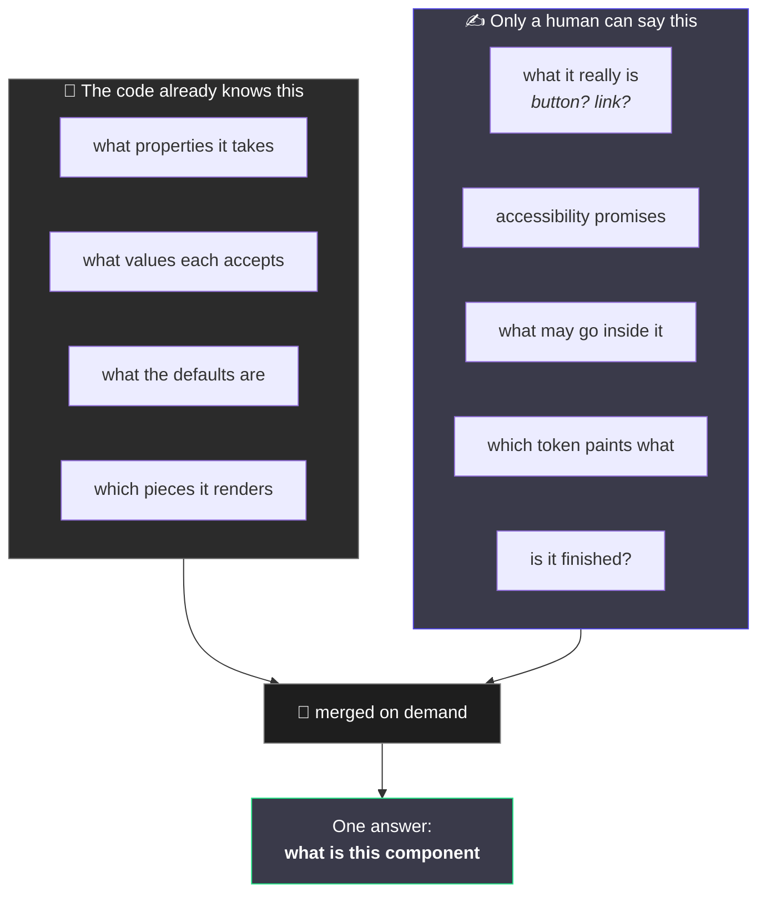
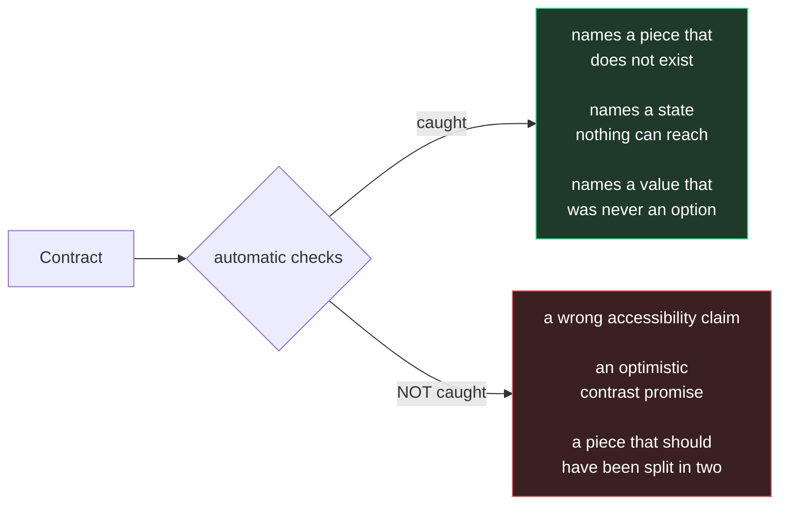

# 2. The two halves of a component

← [Previous](./01-what-this-is.md) · [Index](./README.md) · Next: [Naming the pieces →](./03-anatomy-and-parts.md)

---

## The problem

Open a component in Figma. The right-hand panel tells you a lot: it has a `Size` property with
three values, a `Hierarchy` property with three more, `Size` defaults to Medium.

Now ask it some other questions:

- Is this a button or a link?
- If someone puts only an icon in it, who is responsible for giving it a name a screen reader can
  read?
- That background fill — is it _supposed_ to be a surface token, or did someone paste a hex
  because they were in a hurry?
- Is this finished, or still being figured out?

**Figma has no field for any of that.** Neither does code. The information exists — in the head of
whoever built it, and nowhere else. Six months later they have left, and the only way to find out
is to read the source and guess.

## The idea

Split the description of a component in two, along a very specific line:



The left half is **read out of the code** whenever anyone asks. Nobody writes it down, so it
cannot be wrong.

The right half is **written by hand**, in a small file called `Button.contract.json` that sits
next to the component.

Ask a question and a tool merges the two:

```bash
pnpm contract Button
```

## The rule that makes it work

> **Writing something in the contract that the code already knows is a mistake, not helpfulness.**

This sounds pedantic. It is the entire reason the thing works.

Imagine we let the contract record the list of sizes. Now that list exists twice: once in the
code, once in the contract. Someone adds a size. They update the code, because that is what makes
the button work. They forget the contract.

Now you have a file that _looks_ authoritative, is out of date, and gives no sign of it. Everyone
who reads it is confidently misled. **That is worse than having no file at all** — before, you
knew you had to go and look.

So the contract is not allowed to mention sizes. If you try, a check fails.

### The Figma version of the same problem

You have seen this exact failure. A component with a description that says _"use the Small variant
for compact rows"_ — written when there were three sizes, still sitting there now that there are
five and Small was renamed. Nobody deleted it because nobody knew it had gone stale.

The panel above it is always right, because Figma generates it. The description is only right
until someone forgets.

**The contract is built so that it can only ever contain description-shaped things, never
panel-shaped things.**

## What a contract actually looks like

Shorter than you would expect:

```json
{
  "component": "Button",
  "status": { "level": "experimental", "since": "2026-08-17" },

  "semantics": {
    "element": "button",
    "classNamePassthrough": "root"
  },

  "a11y": {
    "focusVisible": true,
    "minHitArea": 24,
    "contrast": "AA",
    "notes": [
      "Icon-only usage needs a label supplied by whoever uses it. Nothing here can enforce that."
    ]
  },

  "anatomy": {
    "root": {
      "part": "root",
      "paints": {
        "background-color": "--ds-color-fill-",
        "border-radius": "--ds-radius-"
      }
    }
  }
}
```

Read it as five statements:

| Line                   | Says                                                                                       |
| ---------------------- | ------------------------------------------------------------------------------------------ |
| `status`               | Still experimental. The API may move. Do not build something load-bearing on it yet.       |
| `element`              | This is really a `<button>`. Not a div dressed as one.                                     |
| `classNamePassthrough` | If you style this from outside, your styles land _here_                                    |
| `a11y.notes`           | **The most valuable line in the file.** It names something the component _cannot_ enforce. |
| `paints`               | The background must come from the fill token family. Not a hex. Not a brand colour.        |

Notice what is missing: no sizes, no hierarchy values, no defaults. All derivable, so all banned.

## Why `a11y.notes` is the best part

Most documentation tells you what something does. The genuinely useful sentence is usually the
other one — **what it does not do, and whose problem that is.**

> "Icon-only usage needs a label supplied by whoever uses it. Nothing here can enforce that."

That is a handover. It says: there is a hole here, it is real, it is not going to be fixed by the
component, and it is now yours. No checker can catch that, and no amount of reading the code tells
you it was a deliberate decision rather than an oversight.

## What is checked, and what is not



The right-hand column is why a human still reads these. **A confident, wrong accessibility claim
passes every check in this repo.** The tooling makes the file _legal_; only a person makes it
_true_.

---

Next: [Naming the pieces →](./03-anatomy-and-parts.md)
