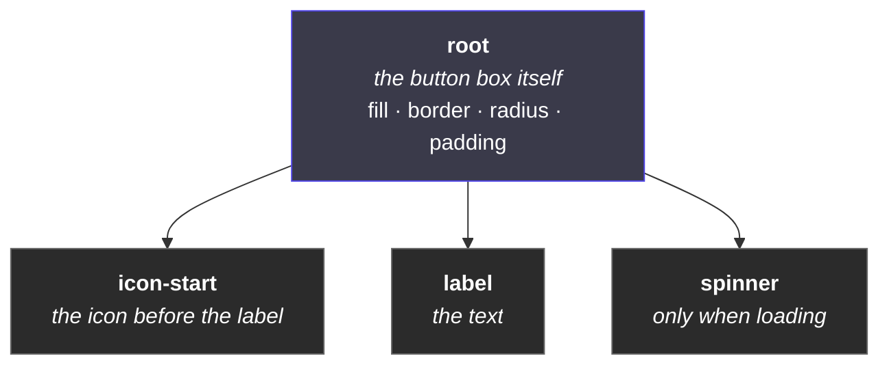
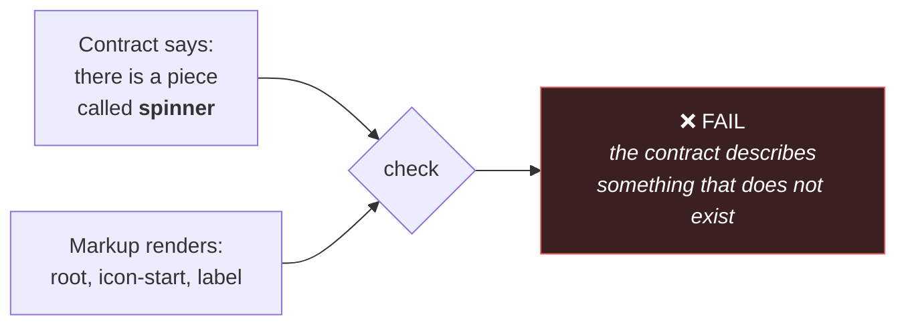

# 3. Naming the pieces

← [Previous](./02-the-two-halves.md) · [Index](./README.md) · Next: [Which token paints what →](./04-tokens-and-paint.md)

---

## This one is basically layer naming

A button is not one thing. It is a box, with an icon slot, a label, and sometimes a spinner:



In Figma you would name those layers. Same instinct, same reason: so people can find them, and so
the thing is legible to someone who did not build it.

The difference is that here, a name is a **promise**.

## Every named piece carries a label in the markup

```html
<button data-ds-part="root">
  <span data-ds-part="icon-start">…</span>
  <span data-ds-part="label">Start recording</span>
</button>
```

`data-ds-part` is just an attribute. Think of it as a layer name that ships.

## Why bother — three reasons

### 1. Real class names are unreadable

Behind the scenes, styling gets scrambled to avoid collisions. The class you wrote as `.root`
becomes something like:

```
Button__root___a1b2c
```

That `a1b2c` changes when the file changes. Nobody can target it, and nobody should try.

`[data-ds-part="root"]` is stable, readable, and does not move. **It is the part of the component
we actually promise to keep.**

So if you need to nudge a component in one specific place:

```css
.myToolbar [data-ds-part='label'] {
  letter-spacing: 0.02em;
}
```

That is a supported thing to do. Reaching for the scrambled class name is not.

### 2. It lets the contract be checked

The contract describes the anatomy. Because every piece is labelled in the markup, a checker can
compare the two:



Without labels there is no way to compare, and the contract becomes a document nobody verifies —
which is how it starts drifting.

This runs in both directions, but only one of them fails:

| Situation                                               | What happens                                                              |
| ------------------------------------------------------- | ------------------------------------------------------------------------- |
| Contract names a piece the component does not render    | **Fails.** It is describing fiction.                                      |
| Component renders a piece the contract does not mention | **Reported, not failed.** Probably an oversight, occasionally deliberate. |

That asymmetry is deliberate. Describing something that does not exist is a lie; forgetting to
document something is just untidy.

### 3. It makes the token rules enforceable

This is the big one, and it gets its own page. Short version: because a piece called `label` is
_also_ styled by a rule called `label`, a tool can follow the thread from the contract's promise
all the way to the actual CSS and check they agree.

That is normally impossible. It is only possible here because of the naming rule.

## The rule, stated plainly

> **A named piece carries `data-ds-part="x"` and is styled by a rule with the same name.**

Break the pairing and nothing crashes. The component works. Tests pass. All that happens is the
token check quietly stops being able to see that piece — it degrades from a check into a comment,
and nobody notices for months.

That is the kind of failure this repo spends most of its energy on: **the ones that produce no
error.**

## States are not pieces

A common mix-up. Two different things:

|           | What it is                        | Example                    |
| --------- | --------------------------------- | -------------------------- |
| **Piece** | a thing that exists in the layout | `label`, `icon-start`      |
| **State** | a condition the whole thing is in | hovered, disabled, loading |

And within states, another split that matters:

- **The browser already owns some states.** Hover, focus, pressed, disabled. You do not track
  these. They are free.
- **A few are yours.** `loading`, `current` — things the browser has no concept of.

So: never build a "hover" property. Hover is not something you set, it is something that happens.
Making it a property means writing code to follow the mouse around to do a job the browser has
been doing for free since 1996.

This sounds obvious written down. It is one of the most common mistakes in a design system built
from a Figma file, because in Figma hover genuinely _is_ a variant — there is nowhere else to put
it. [Page 6](./06-from-figma-to-component.md) is about that translation.

## What this means for you in practice

| You want to                                 | Do this                                                |
| ------------------------------------------- | ------------------------------------------------------ |
| Restyle one bit of a component from outside | Target `[data-ds-part="…"]`                            |
| Know what pieces a component has            | `pnpm contract Button`                                 |
| Suggest a component be split up             | Talk about pieces by name — they are shared vocabulary |
| Style a hover state                         | Nothing. It already works.                             |

---

Next: [Which token paints what →](./04-tokens-and-paint.md)
