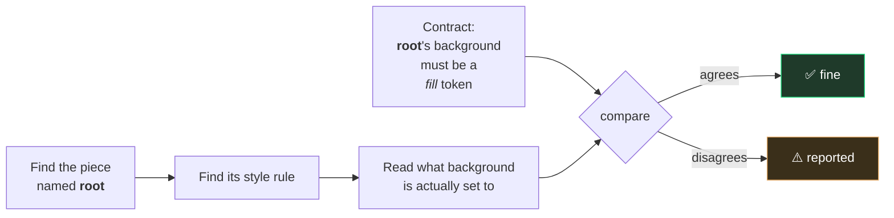
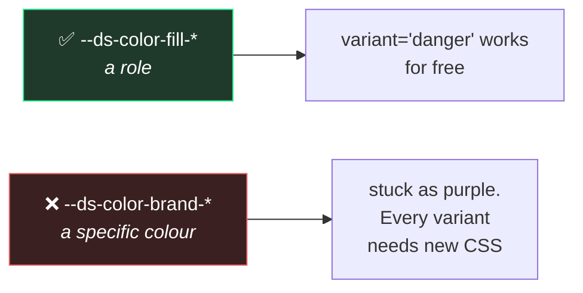

# 4. Which token paints what

← [Previous](./03-anatomy-and-parts.md) · [Index](./README.md) · Next: [The shared vocabulary →](./05-the-shared-vocabulary.md)

---

## The oldest problem in design systems

You publish a token called `surface/primary`. Six months later you open the code and find:

```css
background-color: #1e1e1e;
```

Same colour. Not the token. Nobody did anything wrong on purpose — someone was matching a mockup
at 6pm and typed what they saw.

Now change the surface colour. That button does not move. And nothing tells you, because a hex is
perfectly valid code.

**This page is about how that gets caught.**

## The idea: the contract states a _family_, not a value

Here is the part people find surprising. The contract does **not** say which token to use. It says
which _family_ the token has to come from:

```json
"paints": {
  "background-color": "--ds-color-fill-",
  "border-radius": "--ds-radius-",
  "padding-inline": "--ds-space-"
}
```

Read `"--ds-color-fill-"` as: _"whatever paints this background, it must be one of the fill
tokens."_ Not which one. Just which shelf it came off.

### Why not name the exact token

Because then it would be written down twice — once in the contract, once in the stylesheet — and
[page 2](./02-the-two-halves.md) is entirely about why two copies of one fact always drift.

The stylesheet is the one the browser reads. It is going to win. So the contract deliberately
records something the stylesheet _cannot_ say: the **intent**, which survives the specific token
changing.

An analogy: it is the difference between a rule that says _"this heading is 24px Medium"_ and one
that says _"this heading uses a Display text style."_ The first breaks the moment the scale is
retuned. The second is still true afterwards.

## How it gets checked

Remember from [page 3](./03-anatomy-and-parts.md) that a piece called `label` is also styled by a
rule called `label`. That pairing is what makes this possible:



Run it with:

```bash
pnpm report:paints
```

Two kinds of thing it catches — and the second is the interesting one:

```
Button: root: `background-color: #5146e6` does not satisfy the declared policy `--ds-color-fill-`
Button: root: `border-radius: var(--ds-color-brand-primary)` does not satisfy `--ds-radius-`
```

The first is the hardcoded hex. Expected.

The second is subtler and much more common: **a real token, from the wrong family.** Someone used
a colour token to set a corner radius. It happened to produce the right number, so it looked
fine. Nothing else on earth would have flagged that.

## Why this check is unusual

The system this template borrowed the idea from **cannot do this.** Its own code says so, in a
comment: there is no way to get from a named piece to the style rule that paints it, so its token
policy is documentation rather than a check.

Here it works, and only because of one convention: a piece named `label` is styled by a rule
named `label`. That is the whole trick. One naming rule turns a comment into a check.

Worth knowing, because it is the answer to _"why are we being fussy about naming?"_

## Three things a value is allowed to be

| In the contract                     | Means                                                         |
| ----------------------------------- | ------------------------------------------------------------- |
| `"--ds-space-"`                     | comes from the spacing tokens                                 |
| `"literal"`                         | deliberately not a token — `transparent`, `0`, a 1px hairline |
| `["--ds-color-border-", "literal"]` | **either** is fine here                                       |

That last one is not a fudge. A border is genuinely `transparent` at rest and a real token when
outlined. Both are correct, at different moments.

But keep those lists short. If a single property needs three or four different sources, that
usually means the piece should have been split into two pieces.

**`literal` always wants a reason next to it.** From the outside, "a deliberate transparent" and
"someone pasted a value" look identical. The reason is the only thing separating them.

## One rule worth knowing even if you never touch code

> Style against the **role** tokens, not the **brand** tokens.



`fill`, `border`, `on` are **roles** — slots that get re-pointed depending on the variant. A
component built on roles gets every variant free, forever.

A component built on `brand-primary` is welded to purple. The first time someone asks for a
destructive version, the whole stylesheet gets rewritten.

This is the same reason you would bind a Figma component to a semantic variable rather than a raw
colour, and it fails the same way when you do not.

## It reports, it does not block

`report:paints` never fails a build. Deliberately.

Its reading of the stylesheet is good but not perfect — it does not follow every possible way a
value can be computed. A check that sometimes cries wolf gets switched off, and a switched-off
check protects nothing at all.

So it prints its findings on every run and lets a human judge. Turning it into a hard blocker is a
deliberate later step, once the list is clean and trusted.

---

Next: [The shared vocabulary →](./05-the-shared-vocabulary.md)
