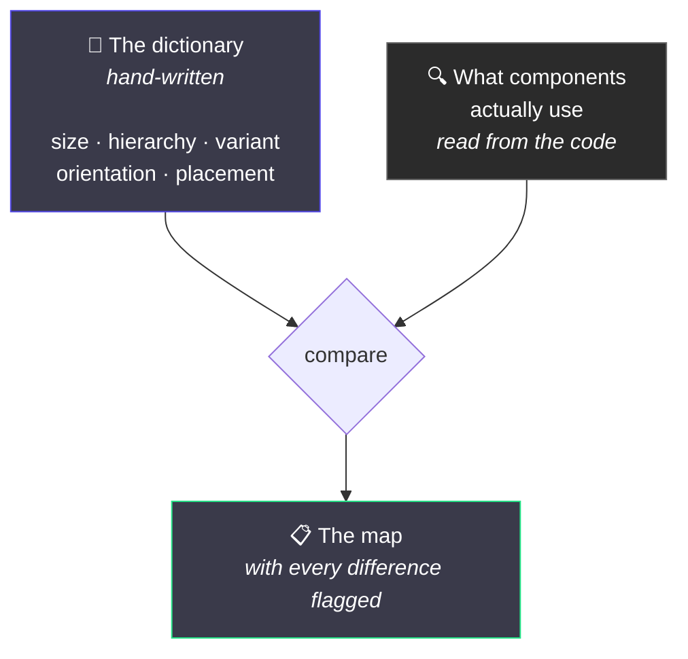

# 5. The shared vocabulary

← [Previous](./04-tokens-and-paint.md) · [Index](./README.md) · Next: [From Figma to a component →](./06-from-figma-to-component.md)

---

## How a design system quietly falls apart

Nobody wakes up and decides to make the system inconsistent. It happens like this:

> **March.** Someone builds a Button. It needs emphasis levels, so they add `hierarchy` with
> `primary` / `secondary` / `tertiary`. Reviewed. Approved. Perfectly sensible.
>
> **June.** Someone else builds a Card. It needs emphasis levels. They have not read the Button.
> They add `emphasis` with `high` / `medium` / `low`. Reviewed. Approved. Also perfectly sensible.

Both reviews were correct. Neither reviewer could have caught it, because **the problem is not
inside either component.** It only exists in the space between them, and nobody reviews that.

Now there are two words for one idea, and every component after this picks one at random.

## The fix: write the dictionary down

There is a file listing the shared property names and their allowed values:



One half is the **dictionary**: what the words _should_ be. Someone writes it.

The other half is **reality**: what components actually do. Nobody writes it; it is read out of
the code, so it cannot be wrong.

Comparing the two is the only place a synonym is visible.

```bash
pnpm prop-map
```

## The current dictionary

| Property      | Means                                 | Values                                         |
| ------------- | ------------------------------------- | ---------------------------------------------- |
| `size`        | one shared scale                      | `xs` `s` `m` `l` `xl`                          |
| `hierarchy`   | how much emphasis an action carries   | `primary` `secondary` `tertiary`               |
| `variant`     | what it means, which picks the colour | `neutral` `brand` `success` `warning` `danger` |
| `orientation` | which way it flows                    | `horizontal` `vertical`                        |
| `placement`   | where it sits relative to its anchor  | a set per situation                            |

Plus an **anti-synonym list** — the part that does the real work:

> `danger` — Error or destructive. Canonical — never `error`, `critical` or `red`.
> `m` — Medium, the default step. Canonical — never `medium` or `md`.
> `neutral` — Default, low-emphasis intent. Canonical — never `default` or `base`.

Each entry names the word **and** the words it is not. That second half is the useful bit. "Use
`danger`" does not stop anyone reaching for `error` — they never saw the rule. "Never `error`"
stops them, because it answers the question they were actually about to ask.

## What happens when someone diverges

Nothing dramatic. It gets written down and labelled:

```
- `size` (Button) — "large" is not a canonical value of the `size` axis
  (xs | s | m | l | xl). · **unreviewed**
```

That `unreviewed` is the point. A difference is not automatically wrong — sometimes the dictionary
is what needs to change. But it cannot slip through _unnoticed_. It sits there labelled
"nobody has looked at this" until somebody does, and then records one of:

| Label      | Means                                   |
| ---------- | --------------------------------------- |
| `fix`      | a mistake, someone should change it     |
| `review`   | genuinely unclear, needs a decision     |
| `accepted` | deliberate, and here is why             |
| `legacy`   | tolerated where it is, never used again |

Always with a reason. And if a note refers to a component that no longer exists, the whole thing
**fails** — so the list cannot rot into a pile of excuses for problems solved years ago.

## Two rules you will feel as a designer

### `variant` and `hierarchy` are different questions

This trips people up constantly, so it is worth being explicit:

|             | Question it answers    | Values                                   |
| ----------- | ---------------------- | ---------------------------------------- |
| `hierarchy` | _how loud is this?_    | primary, secondary, tertiary             |
| `variant`   | _what does this mean?_ | neutral, brand, success, warning, danger |

A destructive action that is also the main action is `variant="danger"` **and**
`hierarchy="primary"`. Two independent dials. If you merge them you end up with an
eleven-value list like `primary` / `secondary` / `danger` / `danger-secondary`, and it grows by
multiplication forever.

The Figma equivalent: two separate variant properties, not one combined one.

### The scale is the scale

`size` uses `xs` `s` `m` `l` `xl`. A component may expose a _subset_ — some things only make sense
in two sizes — but it may not invent `sm`, or `compact`, or add an `xxl` because one screen
needed it.

If a component genuinely needs a step that does not exist, that is a change to the **scale**, made
once, for everyone. Not a local exception.

## Why "it flags but does not block"

The map reports; it does not fail the build.

That is deliberate, and it is the honest position: **a naming choice is a judgement call, and a
tool cannot make it.** `emphasis` might genuinely be the better word. What a tool _can_ do is make
sure nobody chooses it by accident, alone, without knowing the other word already existed.

The one thing that _is_ enforced: the map has to be up to date, and every difference has to be
labelled. You can disagree with the dictionary. You cannot quietly ignore it.

---

Next: [From Figma to a component →](./06-from-figma-to-component.md)
