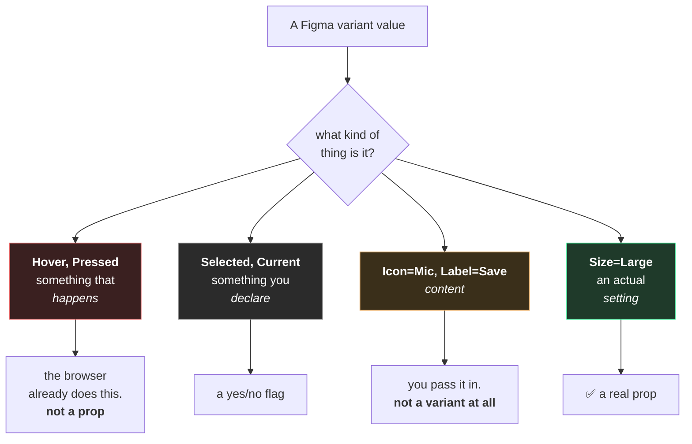
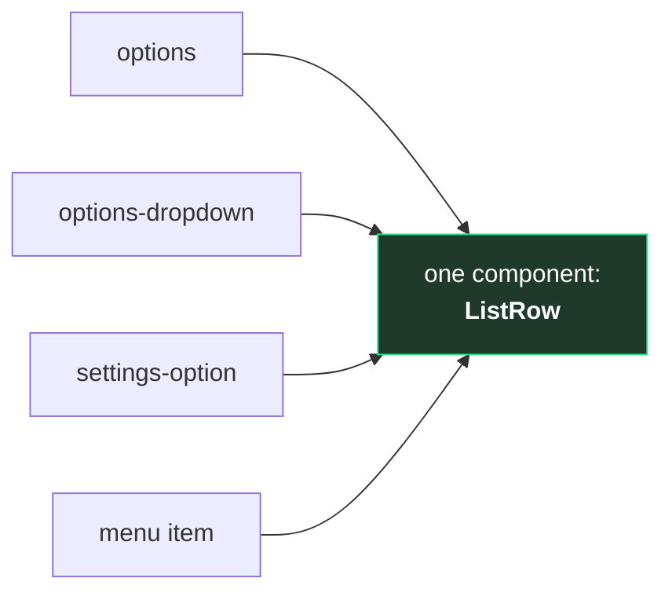
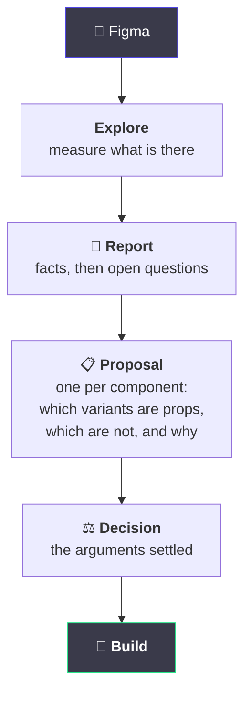

# 6. From Figma to a component

← [Previous](./05-the-shared-vocabulary.md) · [Index](./README.md)

---

## Why your variants do not survive the trip

You hand over a component set with five variant properties. What comes back has three props, and
two of your properties have vanished.

Nothing was lost. They were never props to begin with.

**A Figma variant property and a component property look identical and are not the same thing.**
Figma has exactly one mechanism for "this component has more than one appearance", so _everything_
gets expressed as a variant — whether it is a setting, a moment, or content. Code has three
different mechanisms, and picking the wrong one causes real problems.

## The four buckets

Every variant value sorts into one of these, and only one of them is a prop:

### Hover and Pressed are the big one

In Figma you _have_ to draw a Hover variant. There is nowhere else to put it, and you need to
show it to whoever is building the thing.

In code, hover already works. It has worked since the 1990s, for free, without anyone writing
anything.

If a `state="hover"` prop gets built, it means something has been written to follow the mouse
around and update the component to describe a thing the browser was already handling. It is
slower, it breaks on touchscreens, and it can get stuck showing "hover" when the pointer has gone.

**So the Hover variant is not lost. It is information, and it is used — as a picture of what
hover should look like.** It just becomes a hover rule instead of a property.

### Content is not a variant either

If a component set has variants called `Icon=Mic`, `Icon=Camera`, `Icon=Screen`, those are not
three states of one thing. That is one thing with a hole in it that an icon goes into.

Multiplying content into variants is how a set ends up with 300 of them.

## The trap that costs the most

Here is a real example from the file this template was built for.

The design has **four separate components** that are all, on inspection, the same 52-pixel row
with an icon, a label and a trailing affordance:

They were drawn separately because they appear in four different places. That is a completely
reasonable way to work in Figma — you are laying out screens, not designing an API.

But if they get built as four components, then forever after: four sets of styles, four things to
update when the row height changes, four places for them to drift apart. And they will.

**Spotting this is the entire point of doing the exploration before writing code.** It is only
visible when someone looks at the whole file at once and asks "are any of these the same thing?"
— which is not a question you can answer while designing a single screen.

The reverse trap exists too: one Figma component that is really several. In the same file,
"Button" covers a labelled button, an icon-only toggle, and a control with a live audio waveform
inside it. Same name, three genuinely different components.

## What the process actually is

The **proposal** is where you want to be involved. It is a short document, written before any code
exists, that says: here is what this component set contains, here is which parts of it are
actually settings, and here is what we are deliberately _not_ building.

Arguing at that stage costs nothing. Arguing after it is built costs a rewrite.

### Two rules the process runs on

**Measured and inferred stay separate.** "There are four spacing steps: 0, 2, 8 and 16" is a
measurement. "The gaps suggest two unused rungs" is a reading. If they get mixed together, someone
later quotes the guess as a fact.

**A gap is a finding, not a blank to fill.** If something cannot be determined, it gets recorded
as undetermined rather than guessed. A confident guess never gets revisited; a recorded question
does.

## The section of a proposal that matters most

Every proposal ends with **what we deliberately did not build**, and why. It looks like
bureaucracy. It is the most re-read part of the document.

> The design has four audience colours. Those are a theme applied to a whole area, not a property
> on this component. If audiences ever need different palettes, that is set once at the top, and
> this component stays unaware of it.

Without that paragraph, someone adds an `audience` prop in four months. They are not being
careless — they are looking at the same design and reaching the same first conclusion whoever
wrote the proposal reached, before thinking it through.

That paragraph is the only thing that survives to have the argument on your behalf when you are
not in the room.

## What we will ask you for

| We will ask                                      | Because                                                           |
| ------------------------------------------------ | ----------------------------------------------------------------- |
| Which of these are genuinely the same component? | four near-identical rows is four times the maintenance            |
| Is this a setting, or a moment?                  | settings become props, moments become states                      |
| Which of these differences actually matter?      | every variant is a permanent commitment                           |
| What should this be _called_?                    | see [page 5](./05-the-shared-vocabulary.md) — the word is the API |
| What are we _not_ building?                      | the paragraph that stops it being re-added later                  |

None of these need you to read code. All of them are much cheaper to answer before it exists.

---

[← Back to the index](./README.md)
